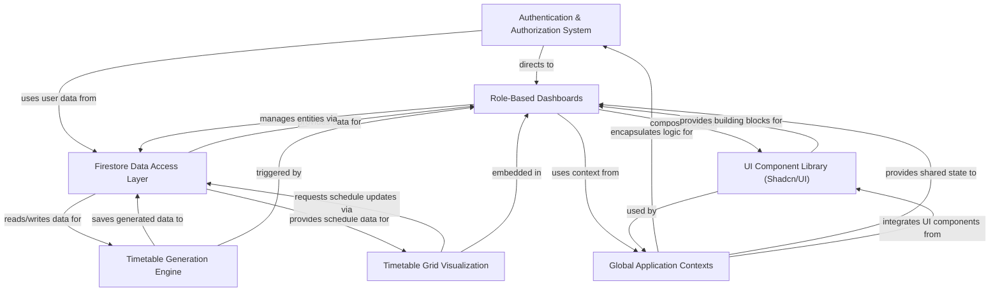

UTAS (University Timetable Automation System) is a comprehensive web application designed to **automate university scheduling**. It provides *role-based access* for administrators, teachers, and students, allowing admins to **manage core entities** like courses, teachers, and rooms, and **generate optimized timetables**. Teachers can view and request *swaps for their schedules*, while students can simply **view their personalized class timetables**.

## Visual Overview

